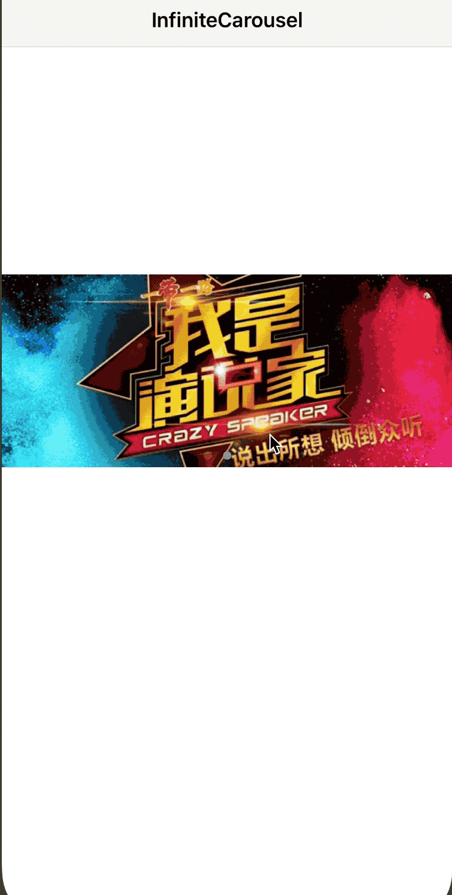

# UnlimitedCarousel

[](http://cocoapods.org/pods/UnlimitedCarousel)
[](http://cocoapods.org/pods/UnlimitedCarousel)
[]()
[](http://cocoapods.org/pods/UnlimitedCarousel)
[](#)


Highly customized Carousel Figure for iOS developed in Swift

## Overview




## Requirements

* iOS 9.0+
* Xcode 9
* Swift 3.2
* SnapKit && SDWebImage

## Installation

### CocoaPods

`UnlimitedCarousel` is avaliable through CocoaPods. 

Add a pod entry for `UnlimitedCarousel` to your Podfile:

```
pod 'UnlimitedCarousel'
```

Install InfiniteCarousel into your project:

```
pod install
```

## Usage

The only thing you need to do is import `UnlimitedCarousel`, create an instance and add it to your `View` via code or StoryBoard, and conform to it's datasource and delegate.

```swift
import UnlimitedCarousel
```

```swift
let carousel = UnlimitedCarousel(frame: CGRect(x: 0, y: 0, width: self.view.frame.width, height: 160))
carousel.delegate = self
carousel.dataSource = self
self.view.addSubview(carousel)
```

Just implement dataSource and delegate.

### dataSource

**Note: number of sections in UnlimitedCarousel is the key to create the infinite effect, 3 or 5 is recommended**.

```swift
extension ViewController: UnlimitedCarouselDataSource {
    func numberOfSections(in carousel: UnlimitedCarousel) -> Int {
        return 3
    }
    
    func numberOfFigures(for carousel: UnlimitedCarousel) -> Int {
        return itemArray.count
    }
    
    func titleForFigure(at indexPath: ICIndexPath, in carousel: UnlimitedCarousel) -> String {
        return itemArray[indexPath.row].title
    }
    
    func picLinkForFigure(at indexPath: ICIndexPath, in carousel: UnlimitedCarousel) -> URL {
        return URL(string: itemArray[indexPath.row].picture_url)!
    }
}
```

### Delegate

```swift
extension ViewController: UnlimitedCarouselDelegate {
    func infiniteCarousel(_ carousel: UnlimitedCarousel, didSelectFigureAt indexPath: ICIndexPath) {
        let item = itemArray[indexPath.row]
        let url = item.link
        let webVC = WebViewController()
        webVC.webUrl = URL(string: url)
        webVC.navigationItem.title = item.title
        self.navigationController?.pushViewController(webVC, animated: true)
        }
    }
}
```

## Customization

```swift
let carousel = UnlimitedCarousel(frame: CGRect(x: 0, y: 0, width: self.view.frame.width, height: 160))
carousel.pageControl.currentPageIndicatorTintColor = 
carousel.pageControl.tintColor = 
carousel.hidesForSinglePage = 
```

## Todo

- [ ] customized srcoll top-down or left-right
- [ ] customized enable PageControl
- [ ] Not longer dependent on `SnapKit` and `SDWebImage`

## Change Log

* v1.3.0

## Contacts

via email: [@NathanLiu](http://nathanliuyolo@gmail.com)

## License

`UnlimitedCarousel` is released under the [BSD 2-Clause "Simplified" License](LICENSE). See LICENSE for details.